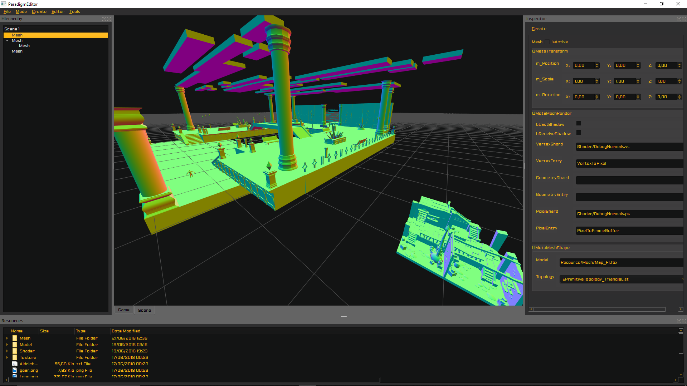
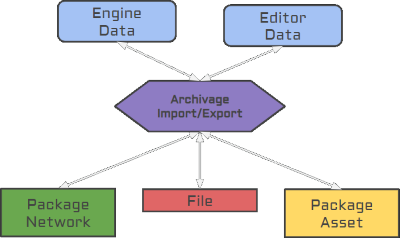

# Paradigm-Engine
This is the result of a project from my 2nd year of study. The goal of the project was to develop a game engine with a team of 3 for 75 days. Teams were limited (3 people) to allow all group members to improve in various areas of engine development.

## ✦ Overview
The project is composed of an editor and engine part. The editor and the high-level interface of the engine are only just beginning. For the moment, the project is not sufficiently successful to be able to simply prototype. 
Nevertheless, the engine offers a low level data oriented architecture with a factory and key system. The main low level interfaces (such as rendering, inputs, physics, viewport, ...) are well underway and the RHI even offers shaders reflection with real time editing capability.

*Paradigm Editor sample*

## ✦ Features

### Architecture
* Low level data oriented (Processors and Factory)
* Custom optimized data structures for data oriented architecture (KeyTable and StaticKeyTable)
* Custom runtime reflection
* Archive system serialisation

### Editor
* Inspector, Asset Folder, Hierarchy, ..

### Inputs
* Input Management (DirectXTK 11)

### Physics
* Native Physic interface (Bullet support only at the moment)
* Rigidbody, Mesh collider, raycast...

### Rendering
* RHI - Native Rendering Interface (Direct3D11 support only at the moment)
* Memory Management
* Shaders reflection
* Runtime shaders edition

### Resources
* Memory Management
* Meshes loading (We make use of ASSIMP: http://assimp.org/)

## ✦ Credits
* **Clara Ripard Minisini**
* **Lucas Benard**
* **Morgan Hoarau**

